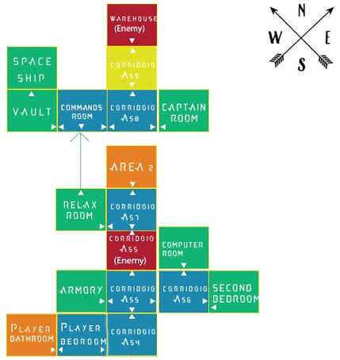
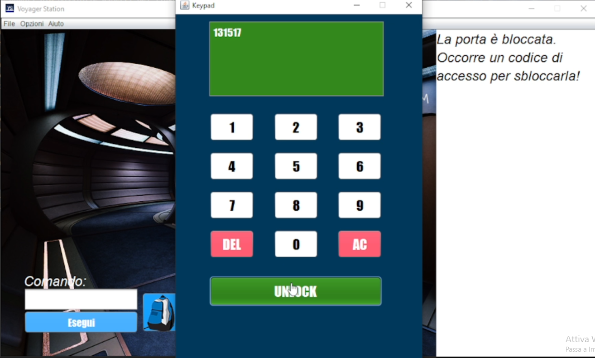

# Voyager Station

<figure>

</figure>

### Descrizione
*Voyager_Station* è un gioco/progetto personale sviluppato per il corso universitario *Metodi Avanzati di Programmazione* presso *[l'Università degli Studi di Bari Aldo Moro](https://www.uniba.it/it/ricerca/dipartimenti/informatica)* nel Luglio 2021, e prende ispirazione su un avvenimento futuro, quello della costruzione della prima stazione spaziale intorno al 2027 denominata **Voyager Station**, che mira ad essere il primo hotel spaziale commerciale mai costruito. L'obiettivo del corso era quello di applicare/ricoprire quanti più possibile aspetti del linguaggio di programmazione **Java** al fine di realizzare una avventura testuale o grafica. Si è utilizzato come **NetBeans** come IDE.

- **Avventura Ibrida (Testuale + Grafica)**: il gioco può essere giocato in maniera ibrida attraverso l'utilizzo di comandi o tramite Point&Click. La scelta di includere una interfaccia grafica è stata intenzionale per rendere l'esperienza del gioco più coinvolgente. In particolare, all’utente è consentito giocare in maniera ibrida, alternando quando e ove possibile, semplici comandi *Point&Click*, o ove necessario, tramite un apposito box di comandi. In alcuni casi, sarà invece necessario interagire esclusivamente in forma testuale o in forma grafica;

- **Uso Esteso delle funzionalità di Java**: si sono sfruttate tutte le diverse funzionalità e concetti di programmazione messe a disposizione dal linguaggio, applicando i concetti della programmazione OOP, ereditarietà, utilizzo delle Collections, Thread, espressioni regolari, file e LambdaExpression, oltre all'utilizzo dell'interfaccia grafica GUI utilizzando il framework **Java SWING**.

> **Nota**: Il gioco/progetto è personale non ha alcuna finalità commerciale. Tutte le immagini utilizzate sono facilmente reperibili online e sono state modificate utilizzando *Photoshop*.

### Storia del gioco
Il personaggio, dopo essere atterrato sulla stazione Voyager, deve dopo un lungo, strano e faticoso viaggio dalla terra, riposarsi per visitare la I.S.S (International Space Station), ma quella che sarebbe dovuta essere la sua esperienza più incredibile, si trasforma nel suo peggiore incubo. Nel 2026 è stato scoperto il patogeno NewAriston che necessita di essere sperimentato, per via delle sue caratteristiche, al di fuori della terra, per comprenderne la sua conformazione e struttura. Tale patogeno si scopre mutare/trasformare però gli umani in esseri spaventosi; il protagonista, ignaro di quello che gli accadrà, dovrà quindi trovare la via di fuga, trovare i codici di accesso alle varie stanze bloccate, scoprire cosa è accaduto e trovare la navicella spaziale che lo possa portare in salvo. Il suo cammino alla navicella però non sarà così semplice…

### Mappa del gioco:
Tipico delle avventure testuali, la mappa è ambientata in una determinata zona/area costituita da varie stanze/aree specifiche. In questo caso, essendo ambientata nella futura stazione Voyager, si è immaginato di avere un insieme di stanze che il giocatore può esplorare e, per alcune di esse, è necessario disporre di codici di accesso o particolari accessori. Di seguito, una sua rappresentazione grafica:

<figure>

</figure>

- le stanze arancioni presentano oggetti che non sono funzionali al proseguimento del gioco;
- le stanze blu rappresentano le stanze prive di oggetti, futili o di passaggio;
- le stanze verdi rappresentano le stanze che devono essere necessariamente visitate e che quindi sono funzionali al proseguimento del gioco;
- le stanze rosse rappresentano stanze in cui sono presenti nemici.

La mappa è gestita come un oggetto, in questo caso una lista della classe *VoyagerStationGame*, contenente oggetti di classe *Room*, rappresentanti le diverse stanze del gioco. Per muoversi da una stanza all’altra, il giocatore dovrà digitate tramite l’apposito box di comandi la direzione dei quattro punti cardinali principali a seconda del nome del comando che rappresenta la direzione, oppure interattivamente premendo una delle quattro frecce rappresentanti le diverse direzioni.

## Meccaniche di gioco

### Inventario
Il giocatore ha a disposizione un inventario in cui potrà aggiungere elementi fondamentali o non al proseguimento dell'avventura. L'inventario può essere aperto tramite l'apposito comando inventario o cliccando sull'icona dello zaino. L'utente può rilasciare gli oggetti contenuti all'interno dell'inventario in alcuni contenitori disposti in alcune stanza, attraverso un appostio form. La seguente figura ne riporta un esempio:

<figure>

</figure>

### Looting
Il giocatore potrà, ove possibile, frugare nell'inventario di npc o nemici, utilizzando il comando depreda o termini simili, si aprirà una GUI in cui potrà visualizzare gli elementi contenuti con relativa descrizione, decidendo se prelevarli. Sono inoltre presenti altri oggetti contenitori che il giocatore può aprire. Un esempio è riportato dalla seguente figura:

<figure>

</figure>

### Enigmi e Keypad
 Considerando il contesto in cui è ambientato il gioco, gli enigmi 
vengono rappresentati tramite dei codici di accesso da trovare per 
accedere alle diverse stanze.
Alcune delle stanze potranno essere visitate o superate se si dispongo 
di alcuni oggetti, o uccidendo dei nemici.
Alcune delle stanze sono bloccate mediante codice di accesso.  Il giocatore dovrà trovare tali codici, osservando alcuni oggetti/nemici/npc o utilizzando il computer presente in una apposita 
stanza. 

Quando l'utente prova ad accedere ad una stanza bloccata, comparirà una nuova GUI che simulerà un **Keypad** in cui il giocatore dovrà inserire il codice di accesso. Se il codice inserito non è corretto, viene mostrato un messaggio di errore nel primo riquadro; in caso positivo invece la stanza viene sbloccata. Mentre se la stanza è bloccata ma non con un codice di accesso, il giocatore dovrà trovare delle chiavi di accesso. Quando si proverà a sbloccare una porta che richiede una chiave di accesso, verrà eseguita una ricerca all'interno dell'inventario e in caso di esito positivo, la porta verrà sbloccata (la GIF precedente mostra tale esempio). Di seguito, invece, un esempio di porta bloccata con codice di accesso:

<figure>

</figure>

### NPC / Nemici
All’interno del gioco sono previsti, seppur in maniera semplificata, dialoghi con degli npc. Il 
giocatore infatti, potrà osservare e parlare con tali npc che avranno la funzione di dare delle 
informazioni più precise per comprendere anche la trama del gioco.
Osservare tali npc/nemici sarà fondamentale per proseguire nell’avventura, in quanto daranno 
preziose informazioni per continuare il gioco.
I personaggi/nemici ereditano dalla classe base *AdvNPC*, che mette a disposizione tutti i 
metodi e gli attributi per descriverli.

Per proseguire l'avventura sarà necessario affrontare ed eliminare i nemici attraverso l'utilizzo di armi (per semplicità si è utilizzata solo un'arma). Il giocatore che entra all’interno di una stanza in cui è presente un nemico, non potrà, a seconda 
della stanza, andare in altre direzioni fino a quando l’alieno non sarà morto. 
Tramite il comando **uccidi/elimina** o termini simili sarà possibile eliminare i nemici e verranno riprodotti dei suoni per simulare l'eliminazione.

<figure>

</figure>

### Menu
Il gioco presenta un menu nel quale il giocatore può salvare o caricare in qualsiasi momento un determinato salvataggio, attivare/disattivare gli effetti sonori e/o musica, e la sezione di aiuto in cui può consultare l'elenco dei comandi del gioco con relativa descrizione. Un esempio riportato come segue:

<figure>

</figure>

### Salvataggio e caricamento
Vengono utilizzati i concetti di <b> serializzazione </b> e <b> deserielizzazione </b> per consentire il salvataggio e il caricamento del gioco in qualsiasi momento. I file vengono salvati nella cartella *saves* (per decisione progettuale) con estensione ".dat". Come si può osservare dalla seguente figura, il gioco ripristinerà, una volta eseguito il caricamento, i seguenti aspetti: 
 - la stanza in cui era presente il giocatore al momento del salvataggio;
 - rimuoverà eventuali oggetti (se contenuti all'interno della stanza) qualora il giocatore li abbia già prelevati; 
 - l'inventario del giocatore;
 - musica (suono di sottofondo) dato che, in momenti e stati diversi, il gioco presenta musiche diverse;
 - stanze già sbloccate,
 - le rappresentazioni dei nemici. Ad esempio se un nemico è già stato eliminato ne ripristina il suo corpo da eliminato. 

Il salvataggio della partita viene effettuato tramite una voce dell’apposito menu. Verrà visualizzato un 
apposito form, in cui verrà richiesto il nome del salvataggio. Nel caso di salvataggio di un file già esistente 
ne verrà richiesta esplicita conferma di sovrascrittura. Il salvataggio è consentito solo a 
gioco avviato. Analogamente, il caricamento di una partita può avvenire tramite la voce 'apri' dell’apposito menu.

 

<figure>

</figure>

## Dettagli tecnici

### Parser
Il *Parser* verifica la correttezza della frase inserita, considerando un token alla volta.
Il *Parser* utilizza il file ‘stopwords’ all’interno del quale sono contenute tutte le proposizioni/articoli che precedono le parole, in modo tale che, durante la suddivisione in token del comando, se dovessero fare parte di questo file, non vengano prese in considerazione. Al fine di rendere il parser leggermente più intelligente e quindi non essere troppo restrittivo e fiscale, tutte le parole inserite dopo il nome di un oggetto/personaggio non verranno prese in considerazione.  Il parser assume dunque la seguente struttura:
1. Comando 
2. Comando2
3. Oggetto/oggetto inventario (opzionale) 
4. Personaggio/Nemico 
5. Oggetto/oggetto inventario 2 (opzionale)
6. ExtraWords

Alcuni esempi di comandi:
> &lt;comando> &lt;comando2> &lt;numero> 
> Esempio: “sblocca ovest 112233”

> &lt;comando>  
> Esempio: “osserva” o “inventario” o “nord, est..”

> &lt;comando> &lt;articolo/preposizione> &lt;oggetto>  
> Esempio: “osserva torcia” o “osserva la torcia”

> &lt;comando> &lt;articolo/preposizione> &lt;oggetto> &lt;articolo> <oggetto inventario> 
>Esempio: “apri la porta con tessera”

> &lt;comando> &lt;comando2> &lt;personaggio> 
> Esempio: “apri inventario nome_personaggio

> &lt;comando> &lt;personaggio>  
> Esempio: “depreda astronauta”

> &lt;comando> &lt;articolo> &lt;personaggio>  
> Esempio: “osserva alieno” o “osserva l’alieno” o “parla con astronauta”

In caso di comandi non riconosciuti o tipologie di frasi non riconosciute, vengono mostrati opportuni messaggi di errore

### Database
Si è utilizzato <b> JDBC </b> (Java DataBase Connectivity) in combinazione con SQL Server, per la creazione dei seguenti database:
- <i> Room Database </i>: contiene alcune informazioni sulle stanze presenti nel gioco, tra cui nome, descrizione, il nome dell'immagine che la rappresenta; 
- <i> Object Database </i>: contiene le informazioni relative agli oggetti contenuti nel gioco;
- <i> Password Rooms</i>: contiene il nome della stanza e il relativo codice di accesso. Quando si prova ad accedere ad una stanza bloccata da un codice di accesso, l'utente inserisce il nome della stanza e il sistema effettuerà una interrogazione sul database per ottenere il codice di accesso, come ad esempio accade nella seguente parte di gioco:
   

<figure>

</figure>

### Thread e Socket
*Thread* e *socket* sono stati utilizzati in maniera congiunta, ma non solo. Nella parte finale del gioco, il giocatore dovrà prendere una navicella di emergenza per tornare sulla terra, ma dato che i comandi automatici non funzionano, il giocatore dovrà inserirli manualmente. Per l’utilizzo delle socket, si è deciso di simulare una sorta di “messenger” o conversazione tramite il giocatore ed un server. Nella parte finale del gioco, verrà infatti mostrato un form particolare nel quale il giocatore dovrà digitare una serie di comandi per giungere alla fine del gioco, come si può osservare dalla seguente figura.

<figure>

</figure>

Nel package **com.voyager.voyager_station.socket**, vi sono le seguenti classi: 
- **Server**: questa classe apre la comunicazione con il server socket sulla porta 6666. Successivamente crea un oggetto di classe *Socket* a cui verrà assegnato l’oggetto di classe socket che conterrà le informazioni di entrambi i socket (client e server). A questo punto, viene quindi passato tale socket ad un thread di classe *CommanderThread*, per soddisfare la richiesta del client;

- **CommanderThread**: questa classe invece rappresenta un thread che rimane in ascolto dell’input dell’utente. In particolare, utilizzando l’input stream dell’oggetto socket passato, gestirà la sequenza dei comandi da inserire, mostrando poi a video tramite la classe *ClientGUI*, il messaggio di output del server. Tale thread utilizzerà l’unica istanza possibile della classe *Spaceship*, al fine di abilitare gli attributi corrispondenti ai comandi avviati, potendo cosi gestire la sequenzialità dei comandi stessi, a seconda che gli attributi di questa classe sia veri o meno;

- **ClientGUI**: questa classe rappresenta un form che mette a disposizione un box di comandi e un’area di testo in cui poter mostrare la risposta del server. Tramite l’apposito box di comandi, il giocatore potrà inviare il comando al socket, che analogamente stabilirà una connessione sulla porta 6666 del localhost, ricaverà la risposta del server, e la stamperà a video. Quando invece, dovrà essere inviato un comando, verrà scritto tale comando sull’stream di output, e dato che il thread in precedenza è ancora in esecuzione, leggerà tale comando dall’input stream ed eseguirà le operazioni necessarie.

I *thread* inoltre, sono anche stati utilizzati singolarmente per specifiche funzioni. Per esempio, all’interno della classe *GUI*, si è definito una classe interna *PlayGif* che estende la classe *Thread*, utilizzata per riprodurre delle Gif, specificandone la durata tramite il set di un attributo della classe stessa. Questo thread continuerà la propria esecuzione sino a quando un attributo specifico non segnalerà la sua terminazione. Questa realizzazione è stata necessaria in quanto, le modifiche di un evento sono rese effettive solo alla terminazione del metodo associato all’evento. Infatti, in questo modo, verrà terminata l’esecuzione del metodo associato all’evento, e continuerà l’esecuzione del thread consentendo quindi la visualizzazione della GIF

### Interfacce
Nel progetto le interfacce sono state utilizzate affinché l’applicazione possa supportare anche lingue diverse. L’interfaccia *InterfaceCommandNames* viene utilizzata per far sì che sia possibile inserire comandi in diverse lingue. Per esempio, nel progetto sono state definite le interfacce *ItalianCommandNames*. Sarà a questo punto possibile istanziare una classe che estende la classe *GameDescription* passando al costruttore l’interfaccia corrispondente alla lingua desiderata, in modo tale che i comandi assumano i nomi e sinonimi descritti in quella interfaccia. 
Esempio:
- il comando ‘dormi’ può essere equivalente al comando ‘*sleep*’, presupponendo che vi sia una classe *EnglishCommandNames* che implementa tale interfaccia.

L’interfaccia **InterfaceObjectParameters** viene utilizzata per far in modo di indicare gli oggetti a seconda della lingua selezionata. Per esempio, se definissimo una classe *SpanishObjectParameters* che implementa questa interfaccia, potremmo specificare il nome e gli alias di ciascuno degli oggetti presenti all’interno del gioco. In questo modo, potremmo esprimere comandi del tipo: *recoger linterna* (raccogli torcia). 

Analogamente, l’interfaccia *InterfaceNPCParameters* viene utilizzata per fare riferimento agli NPC presenti nel gioco, a seconda della lingua selezionata. Per cui anche in questo caso, se definissimo una classe *EnglishNPCParameters*, potremmo specificare il nome e gli alias di ciascuno degli NPC presenti all’interno del gioco. Pertanto, saranno valide espressioni del tipo: *talk with man*, *kill alien*, se presupponiamo l’esistenza di una classe, come quella descritta in precedenza…
L’utilizzo di queste interfacce, si è reso fondamentale, dal momento che la classe GUI, gestisce tutta la parte grafica del gioco, quindi il posizionamento degli oggetti/NPC presenti nel gioco. In questo modo, ogni oggetto/npc rappresentato tramite un *JButton*, potrà assumere il relativo nome specificato dalla relativa interfaccia. Infatti, se l’oggetto *JButton* che rappresenta la torcia, avesse come nome *torch*, ma la lingua selezionata è spagnola, molte delle funzioni grafiche non potrebbero essere realizzate.

### Collection:
Sono state utilizzate in svariati punti delle particolari *Collection*, tipicamente delle *HashMap*, oltre che delle generiche *List*, utilizzate per la memorizzazione di sequenze di oggetti o stringhe. In particolare, essendo l’applicazione quasi interamente grafica, si è utilizzata all’interno della classe GUI, una *HashMap* che ha come chiave un oggetto di classe *JButton* e come valore un oggetto di classe *Room*. 

In questo modo infatti, dato che ad ogni oggetto visualizzabile corrisponde una relativa immagine e un oggetto è presente in una specifica stanza, questo consente alla classe GUI, di visualizzare o meno un oggetto quando ci si sposta in una determinata stanza. Analogamente, si utilizza, con la medesima logica, una *HashMap* nella classe *InventoryGUI*, per consentire la visualizzazione degli oggetti presenti nell’inventario e poterli selezionare per visualizzare la relativa descrizione

### Lambda Expression:
Le lambda expression sono state utilizzate maggiormente nella classe *InventoryGUI*, per gestire la parte grafica relativa all’inventario del giocatore. In particolare, all’interno del metodo *removeItem()*, viene richiamato il metodo processElement() che utilizzerà la map in cui sono memorizzate le coppie *<JButton, AdvObject>*, il quale selezionerà il corrispondente oggetto *JButton*, rimuovendone l’icona associata, dall’inventario del giocatore e dalla map stessa. Ancora, lo stesso, viene anche richiamato nel metodo *ActionPerfomed* della *PrintDescriptionAction*, che corrisponde alla visualizzazione della descrizione dell’oggetto se cliccato. In particolare, utilizzando la map, si cerca l’oggetto corrispondente e ne verrà mostrata la descrizione. 

Inoltre, una particolare *lambda expression*, è stata utilizzata anche nella classe GUI, per consentire la visualizzazione del testo con effetto *typewriting*, che viene utilizzato in diversi contesti o quando si effettua un dialogo con npc. Si è infatti definito nel metodo *printText()* un *taskPerformer* che ha come parametro un evento evt, ed esegue le relative operazioni per simulare la visualizzazione del testo in stile *typewriting*. Altre espressioni lambda piuttosto brevi sono state utilizzate all’interno del codice

### Espressioni regolari:
Oltre ad essere utilizzate per le tipiche funzioni di split, sono state utilizzate talvolta delle espressioni regolari per controllare che determinate stringhe soddisfacessero specifiche espressioni regolari. Dato che alcune stanze sono bloccate con un codice di accesso di sei cifre, del tipo: 123456, se l’utente digita il comando in maniera testuale sblocca ovest 123456, si controlla se l’ultima stringa corrispondente alla parte sei (vedi Parser), allora si utilizzano le due seguenti espressioni regolari: 

- ([0-9]*[a-zA-Z]+[0-9]*): questa espressione regolare viene utilizzata per controllare se la stringa inserita abbia dei caratteri. In tal caso, verrà mostrato un messaggio di errore che specifica di inserire solamente numeri.

- [\\d]{6}: questa espressione regolare, invece, viene utilizzata per controllare se, la stringa oltre a non contenere caratteri e/o caratteri speciali, contenga solo numeri e, in tal caso, che essi siano esattamente sei, utilizzata per controllare i codici di accesso dalla classe *Keypad*.

Nel caso in cui il giocatore esegua un comando direzionale che corrisponde alla stanza bloccata con un codice, verrà visualizzato a schermo un form particolare, che assume le sembianze di un tastierino numerico tramite il quale l’utente potrà digitare il codice che sblocca la stanza. In questo caso verrà passato la stringa &lt;sblocca> &lt;direzione> &lt;codice inserito> al *Parser*, ove il codice inserito verrà restituito come *extraWords*, dal momento che non è previsto un comando specifico per l’immissione del codice.

### File
I file sono stati utilizzati per consentire il salvataggio ed il caricamento di una partita, in qualunque momento del gioco. Il salvataggio e caricamento avviene mediante i metodi *save()* e *load()* della classe *VoyagerStationGame*, sfruttando i concetti di serializzazione e deserializzazione. Ogni classe che deve essere serializzata implementa l'interfaccia *Serializable*. 

Viene utilizzato il file “stopwords”, che consente al parser di verificare se un token faccia parte di questo file passando al token successivo in caso positivo. Sono stati utilizzati per cercare di rendere più chiara l’esperienza di gioco, in particolare la trama come il file _dossier.txt_ è stato utilizzato per consentire di scoprire più informazioni annesse alla storia del gioco.
